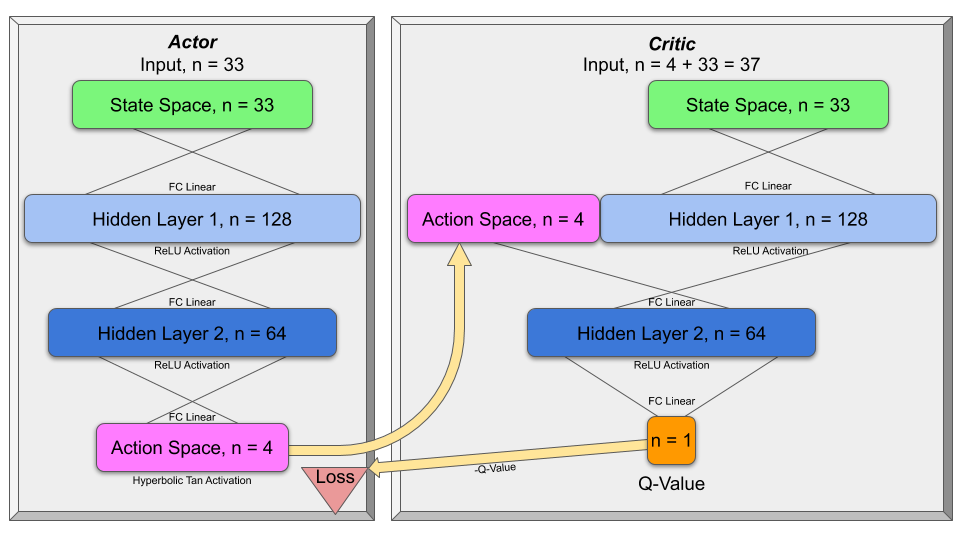
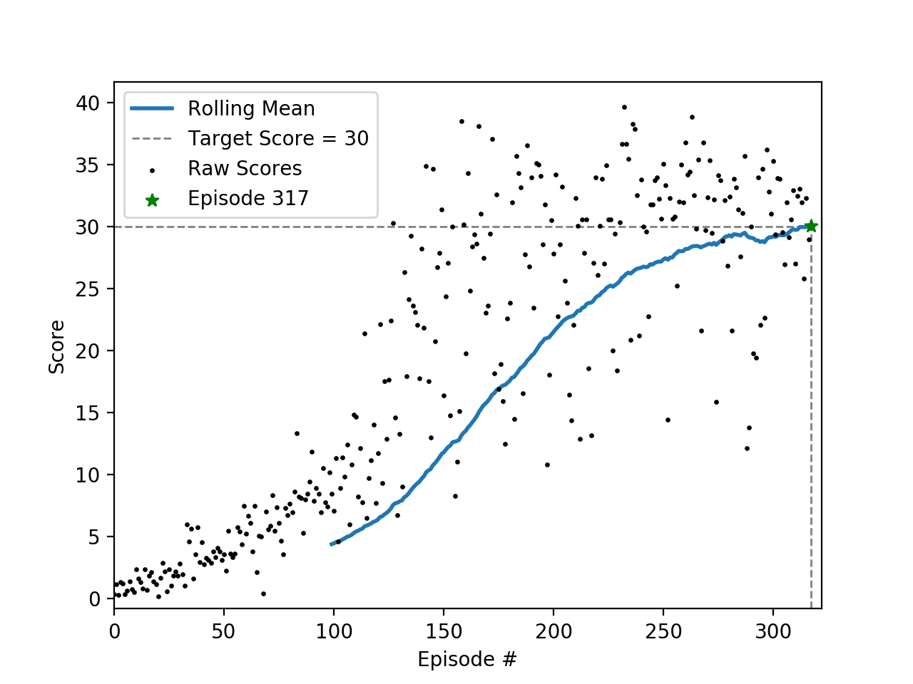

# Project 2: Reacher - Report

## Introduction
This report is written to satisfy the `Report` component of the project 2 rubric and is divided into three sections per 
the [rubric](https://review.udacity.com/#!/rubrics/1890/view).

## Learning Algorithm  
As defined in the rubric, this section _"clearly describes the learning algorithm, along with the chosen hyperparameters.
It also describes the model architectures for any neural networks"_.

This implementation uses a custom Python package `hunter` contained in this repository.  Within this package exists 3 submodules `model`, `dqn_agent` and `test`.

### `model` Submodule
The `model` submodule  defines a `QNetwork` class that extends the `torch.nn.Module` class.  
It's initialization method accepts the following 4 arguments.  
- `state_size` (int): Dimension of each state.  
- `action_size` (int): Dimension of each action.  
- `seed` (int): Random seed.  
- `h_sizes` (tuple): The number of nodes for each hidden layer.  

From the `h_sizes`, linear fully connected hidden layers are created with the `torch.nn.ModuleList` method.  A linear layer is also added to connect the input layer to the hidden layers and the hidden layers to the output layer.  

The `QNetwork` class also has a `forward` method that accepts the current state and propagates it forward through the linear network, while applying the `torch.nn.functional.relu` rectified linear unit to each layer in the propagation.  This method then returns the result of the output layer as a `torch.tensor`.

### `dqn_agent` Submodule
The `dqn_agent` submodule defines 2 classes; `Agent` and `ReplayBuffer`.  

The `ReplayBuffer` class stores the experience tuples with its `add` method and allows them to be sampled with its `sample` method to perform experience replay learning.  

The `Agent` class creates a Double Q-Learning Network from the `hunter.model.QNetwork` class; `self.qnetwork_local` and `self.qnetwork_target`.  It also employs experience replay with `self.memory` using the `hunter.dqn_agent.ReplayBuffer`.  

The `Agent.act` method returns the appropriate Epsilon-greedy action based on the given `eps` value and the maximum state-action pair from `self.qnetwork_local`.

The `Agent.learn` method is given a set of experiences, which are a tuple of (s, a, r, s', done) tuples, and a discount factor `gamma`.  From these experiences it calculates the expected Q-value as `r + gamma * V(s')`, where `V(s')` comes from the `self.qnetwork_target`.  This expected value is compared with the predicted value from `self.qnetwork_local` to determine the loss with the `torch.nn.functional.mse_loss` function.  The loss is then passed through a backward propagation and the `torch.optim.Adam` optimizer to train the `self.qnetwork_local` network.  The final step is to update the `self.qnetwork_target` weights from `self.qnetwork_local` using the given `tau` parameter and the equation `target = tau*local + (1-tau)*target`.

### `train` Submodule
The `train` submodule brings the `model` and `dqn_agent` submodules together to train the agent.  

The `train.setup` function simply initializes the environment and agent.  
The `train.train` function takes the given environment and agent, then trains the agent for the given maximum number of episodes or until the running mean error for 100 episode is 13 or greater.  Once the training is complete the weights are saved as `checkpoint.pth` and the scores are saved as a NumPy object as `scores.npz`.

For each time step, the function first determines the action `a` from the `Agent.act` method and the current state `s`.  Then queries the environment to determine the resulting next state `s'`, reward `r` and if the episode is `done`.  This combines to make an experience `(s, a, r, s', done)` tuple.  

The `Agent.step` method then adds this experience to memory and if the time step is a multiple of `UPDATE_EVERY` global variable, the `Agent.learn` method is called with a random sample of experience tuples from memory to update the Q-Networks as described above.  This is repeated for each time step until a True `done` value is returned from the environment.  

The `Agent.make_plot` submodule simply reads the `scores.npz` file and generates a plot of the reward evolution.  

### Hyperparameters
The hyperparameters used in the successful training are listed below.
- `gamma = 0.99` The discount factor used in `r + gamma * V(s')` from `Agent.learn`.
- `tau = 0.001` The update factor used in `tau*local + (1-tau)*target` from `Agent.learn`.
- `lr = 0.0005` The learning rate passed to the `torch.optim.Adam` optimizer.
- `UPDATE_EVERY = 4` How frequent `Agent.step` calls `Agent.learn`.
- `batch_size = 64` How many random experiences are passed to `Agent.learn`.
- `eps_start, eps_decay, eps_end = 1.0, 0.995, 0.01` Used to calculate the probability that the greedy action or random action is selected with the equation `eps = max(eps_end, eps_decay * eps)`.
- `max_t = 1000` The maximum number of time steps per episode.  

### Model Architecture
The `test.setup` method creates the model architecture with three linear fully connected hidden layers based on the given state and action space sizes with the following number of nodes.  
1. 1st layer is the same as the state space.  
2. 2nd layer is also the same as the state space.  
3. 3rd layer is the integer mean of the state and action spaces.  

The image below illustrates this network.  Obviously, except for the output layer, the number of nodes is reduced to simplify the image.  

## Plot of Rewards  
The image below illustrates the score of each episode as well as the running average score for the last 100 episodes.
As you can see, the algorithm solves the problem in **_XXX_** episodes by hitting a running average of +30.  Note that
the score is the sum of the rewards the agent receives in an episode without discounting.

## Ideas for Future Work
There is still much to be done for this project.  The most obvious would be to try different architectures, including number of nodes per layer, number of layers and the activation functions.  A little script could even be written to optimize these features.  
Prioritized learning is another interesting strategy that would be worth trying.  
Since the noise in this environment is fairly low, I don't expect drop out to be very effective, however testing this hypothesis could be enlightening.
And as always, tuning the hyperparameters and testing different optimizers and loss functions would most likely yield improvements.
